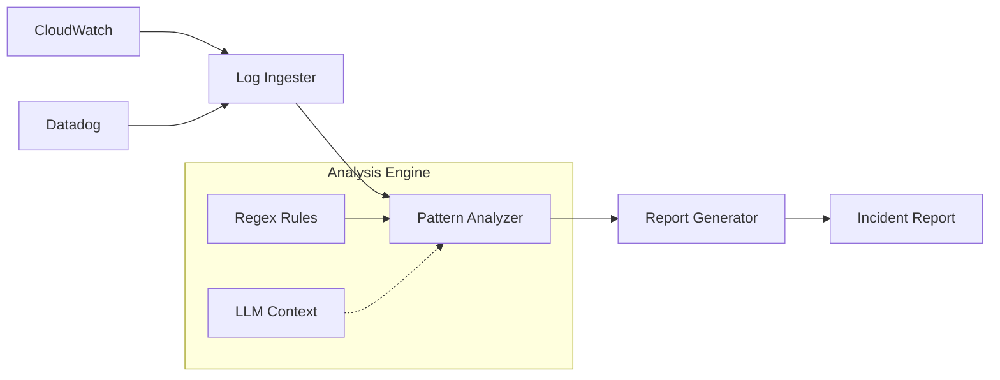

# agent-log-investigator

[](https://github.com/Jai-Gogineni/agent-log-investigator/actions/workflows/ci.yml)
[](https://opensource.org/licenses/MIT)
[](https://www.typescriptlang.org/)
[](https://modelcontextprotocol.io)

> Log investigation agent — finds root cause from CloudWatch/Datadog logs

## Architecture



## Quick Start

```bash
# Clone the repository
git clone https://github.com/Jai-Gogineni/agent-log-investigator.git
cd agent-log-investigator

# Install dependencies
npm install

# Build
npm run build
```

## Configuration

| Variable | Description |
|----------|-------------|
| `CLOUDWATCH_ENDPOINT` | AWS CloudWatch Logs endpoint |
| `DATADOG_API_KEY` | Datadog API key |
| `DATADOG_APP_KEY` | Datadog application key |

## Project Structure

```
src/
├── agent.ts              # MCP server entry point
├── log-ingester.ts       # CloudWatch/Datadog log fetcher
├── pattern-analyzer.ts   # Regex + LLM pattern detection
└── report-generator.ts   # Structured incident report output
```

## MCP Tools

| Tool | Description |
|------|-------------|
| `investigate_logs` | Full pipeline: ingest → analyze → report |
| `analyze_pattern` | Analyze raw log lines for patterns |

## License

MIT © 2024 Jai Gogineni
