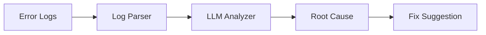

# agent-log-investigator

[](https://github.com/Jai-Gogineni/agent-log-investigator/actions)
[](LICENSE)
[](https://www.typescriptlang.org/)

Log investigation agent that ingests error logs from CloudWatch or Datadog, identifies root cause patterns using LLM analysis, and suggests actionable fixes.

## How It Works



## Quick Start

```bash
git clone https://github.com/Jai-Gogineni/agent-log-investigator.git
cd agent-log-investigator
npm install
cp .env.example .env  # Add your API keys
npm run build
```

## Configuration

| Variable | Required | Description |
|----------|----------|-------------|
| `ANTHROPIC_API_KEY` | Yes | For LLM root cause analysis |
| `DATADOG_API_KEY` | No | For pulling logs from Datadog |
| `AWS_REGION` | No | For CloudWatch log access |

## Example Usage

```typescript
import { LogInvestigatorAgent } from "./src/agent";

const agent = new LogInvestigatorAgent(process.env.ANTHROPIC_API_KEY!);
const result = await agent.investigate([
  "ERROR: Connection refused to payment-service:8080",
  "WARN: Retry attempt 3/3 failed",
  "ERROR: Circuit breaker OPEN for adyen-capture"
]);
console.log(result.rootCause);
console.log(result.suggestion);
```

## Architecture

Built with TypeScript for type safety, uses the Anthropic SDK for LLM capabilities, and follows a single-responsibility pattern where each agent has one clear job. Designed to be composable — agents can be chained together for complex workflows.

## Contributing

See [CONTRIBUTING.md](CONTRIBUTING.md) for guidelines.

## Author

**Jai Gogineni** — [jaigogineni.com](https://jaigogineni.com) · [LinkedIn](https://uk.linkedin.com/in/jai-gogineni-9a396654)
